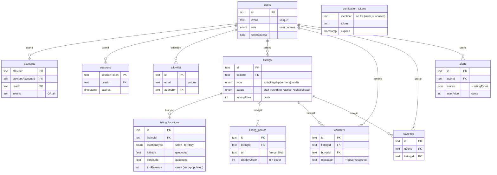

# HS Marketplace — Database ER Diagram

A rendered image lives alongside this file at `database-erd.svg` (open in a browser).
The Mermaid source below is the editable version — it renders on GitHub and in most
Markdown editors. Money is stored in integer **cents**.

## Notes
- **`users`** and **`listings`** are the two hubs. `users` owns auth + all engagement
  rows; `listings` owns its locations/photos and the engagement that targets it.
- **`verification_tokens`** has no FK — it's a standard Auth.js table, unused with
  Google-only sign-in.
- **Not shown** (orphan tables left in the DB from early `drizzle-kit push`, not in the
  schema): `user_favorites`, `signed_ndas`, and a legacy `photos` table (the app uses
  `listing_photos`). Candidates for cleanup.
